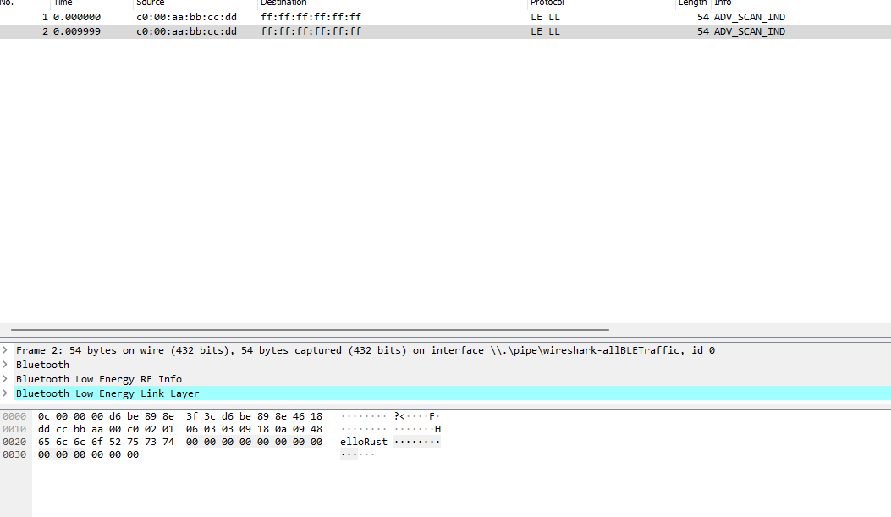

# Remarks regarding Renode

We were not able to get Embassy BLE functionality to work on Renode.

For documentation purposes, we list the following problems for getting Embassy to work on Renode: 

Solved Problems:

- Configuring MBR to boot correctly [[1]](renode.html#booting-with-the-softdevice-solved)
- Sending advertisement packets once [[2]](renode.html#sending-an-advertisement-once)

Known Open Problems:

- Temperature Sensor Peripheral needed [[3]](renode.html#using-bluetooth-with-the-softdevice)
- Decoding of [defmt](https://github.com/knurling-rs/defmt) over RTT needed [[4]](renode.html#general-problems)

Unknown Open Problems:

- The program waits forever after sending an advertisement once [[2]](renode.html#sending-an-advertisement-once)


The following subsections go into the details of these.

## Booting with the SoftDevice [Solved]

Embassy on ony nRF52 chip (so including the nRF52840) is using Nordic Semiconductor's closed source [SoftDevice](https://infocenter.nordicsemi.com/topic/struct_nrf52/struct/nrf52_softdevices.html) for some features but most importantly Bluetooth.

The first hurdle when building Embassy with the SoftDevice normally is how to configure and combine those two generally, as a lot of it depends on the exact version and configuration you are going to use.

When downloading the SoftDevice we get a `.hex` file in the Intel HEX format, so as a preparation, we convert that to a flat binary file:

```
objcopy --input-target=ihex --output-target=binary s140_nrf52_7.3.0_softdevice.hex s140_softdevice.bin
```

Generally speaking, what should work is loading the binary and [matching SoftDevice](https://infocenter.nordicsemi.com/index.jsp?topic=%2Fcomp_matrix_nrf52840%2FCOMP%2Fnrf52840%2Fnrf52840_comp_matrix.html) like this:

```
sysbus LoadELF $binary
sysbus LoadBinary $softdevice 0x00
```

But when you load them like this, Renode assumes the VectorTableOffset (which is where the [Vector Table](https://developer.arm.com/documentation/dui0662/b/The-Cortex-M0--Processor/Exception-model/Vector-table) is positioned) is in the ELF file / in the binary.
This boots up correctly but the SoftDevice is not initialized, so the program operates like no SoftDevice is loaded.

To fix this we tell Renode that we want the Vector Table of the SoftDevice to be loaded:
```
cpu VectorTableOffset 0
```

But for some reason, this already causes a boot loop and our program to never load.

To cite the API docs included with the SoftDevice:
```
 * The MBR assumes that either @ref MBR_BOOTLOADER_ADDR or @ref MBR_UICR_BOOTLOADER_ADDR is set to
 * the address where the bootloader will be copied. If both addresses are set, the MBR will prioritize
 * @ref MBR_BOOTLOADER_ADDR.
```

For the SoftDevice 140 NRF52 7.3.0 these are defined as:

```
/** @brief Location (in the flash memory) of the bootloader address. */
#define MBR_BOOTLOADER_ADDR      (0xFF8)

/** @brief Location (in UICR) of the bootloader address. */
#define MBR_UICR_BOOTLOADER_ADDR (&(NRF_UICR->NRFFW[0]))
```

By default `MBR_BOOTLOADER_ADDR` seems to be set to `0`, so after that the bootloader tries `MBR_UICR_BOOTLOADER_ADDR` which in our setting is also by default `0`, which causes the boot loop.

The actual SoftDevice starts directly after the MBR, which seems to be at address `0x1000` (given we load it at `0x0000`):
```
/** @brief The size that must be reserved for the MBR when a SoftDevice is written to flash.
This is the offset where the first byte of the SoftDevice hex file is written. */
#define MBR_SIZE                (0x1000)
```

So by either setting `MBR_UICR_BOOTLOADER_ADDR` to `0x1000` or patching the SoftDevice binary at address `MBR_BOOTLOADER_ADDR` to be `0x1000` we can get the SoftDevice to boot up correctly.

## Using Bluetooth with the SoftDevice

Enabling Bluetooth functionality with the SoftDevice requires a temperature sensor peripheral, which is not implemented in Renode.

From the API documentation, this seems to be the case because of some problems with rssi sampling ( [153](https://infocenter.nordicsemi.com/index.jsp?topic=%2Ferrata_nRF52840_EngC%2FERR%2FnRF52840%2FEngineeringC%2Flatest%2Fanomaly_840_153.html) , [225](https://infocenter.nordicsemi.com/index.jsp?topic=%2Ferrata_nRF52833_Rev2%2FERR%2FnRF52833%2FRev2%2Flatest%2Fanomaly_833_225.html) ):

```
ERRATA-153 and ERRATA-225 require the rssi sample to be compensated based on a temperature measurement.
```

By providing dummy sensor values we were able to get further into the Bluetooth Stack and make the examples send a single burst of advertisements.
After that, the program seemed to get stuck in the `embassy_executor::arch::thread::Executor::run` at a [`wfe`](https://developer.arm.com/documentation/dui0473/m/arm-and-thumb-instructions/wfe) instruction seemingly waiting for a timer interrupt that never happens.

We were not able to further figure out where the exact problem lies.

## General Problems

A general problem with combining Embassy and Renode is the method Embassy uses for debug output.
Compared to other frameworks that treat serial output as the standard way of communication, Embassy treats serial like any other peripheral and has no shortcuts for using it.
This is rather good when working with the SoftDevice that has some caveats with regards to Interrupt priority and how Interrupts can be used after the SoftDevice has been initialized.

Even better Embassy on the NRF makes use of [SEGGER's Real Time Transfer technology](https://wiki.segger.com/RTT) through the programmer on the board to deliver general and debug information or even warnings and crashes.
The message transfer happens using the [defmt](https://github.com/knurling-rs/defmt) library which encodes the information efficiently so e.g. fixed strings can be referenced by index instead of being repeatedly sent over the wire.

With Renode the problem is that that RTT as a communication method is not implemented and for the output to be actually useful decoding for `defmt` needs to be implemented additionally.

Without this working with Embassy and debugging it is extremely difficult given you are basically working blind and even the [Embassy NRF-Softdevice](https://github.com/embassy-rs/nrf-softdevice/tree/master) itself assumes you have this output for configuring the memory for the SoftDevice.


## Sending an Advertisement Once

We are able to get the [advertiser example](https://github.com/embassy-rs/nrf-softdevice/blob/master/examples/src/bin/ble_advertise.rs) running in Renode but after sending the following packets it freezes in the before mentioned `embassy_executor::arch::thread::Executor::run` function.

