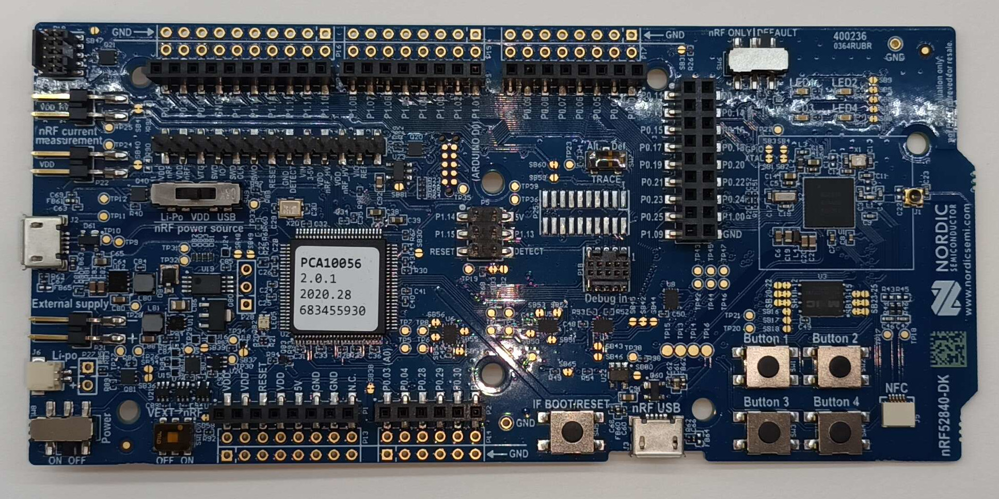

# Hardware

We work with the [nRF52840 DK](https://www.nordicsemi.com/Products/Development-hardware/nrf52840-dk) a development board for the [nRF52840 SoC](https://www.nordicsemi.com/products/nrf52840) which is a wide-spread readily available BLE capable chip that is supported in all of the mature frameworks we looked over.
In particular all evaluated frameworks specifically support the nRF52840 DK board and pin layout specifically as well.
With a few exceptions the nRF52 row of chips was also supported in the newer frameworks which didn't end up in this list for various reasons (see [here](../os) for a list of them).
[Renode](renode), the simulation framework we wanted to use for testing also has nRF52840 support and BLE examples with Zephyr.

## Working in WSL2

When working on Windows through WSL there are two ways to flash the device.

The first method is to follow the [segger wiki](https://wiki.segger.com/WSL) which means running the  J-Link Remote Server on the Windows side and the J-Link Commander on the WSL side.
Now you can interact and flash the device over the LAN from WSL to Windows.

This has some problems with some of the toolchains listed in the OS section because they do not expect this causing them to either not find the device or prompt reentering the connection IP multiple times per command.

Alternatively, there is [usbipd-win](https://github.com/dorssel/usbipd-win/wiki/WSL-support) which you install on your Windows and WSL machine.
This allows you to forward the USB connection to the device directly into the WSL machine.
For this, you first list all the devices connected to your Windows machine `usbipd wsl list` and then attach the SEGGER programmer to the WSL machine `usbipd wsl attach --busid <deviceID>`.
Note that some commands restart the device or cut the connection and reattaching is required. 
