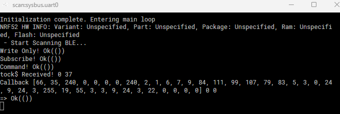

# Examples

The Tock C library provides a few Bluetooth Low Energy [Examples](https://github.com/tock/libtock-c/blob/master/examples/) whereas the [Rust Library](https://github.com/tock/libtock-rs/tree/master/examples) does not so we have translated two of these examples to Rust.
One problem here is that the C library actually provides [proper support](https://github.com/tock/libtock-c/blob/master/libtock/ble.c) for interacting with the BLE Advertising Driver but the Rust library (currently) doesn't.
This means we had to [port these parts](https://github.com/Pusty/AreWeIoTYet/blob/main/tock/examples/ble.rs) and have to interact directly through the abstraction of the syscall interface with the driver ourselves.

## BLE Advertising

The [Rust BLE Advertising Example](https://github.com/Pusty/AreWeIoTYet/blob/main/tock/examples/ble_advertising.rs) is a rough translation of the [C Advertising Example](https://github.com/tock/libtock-c/blob/master/examples/ble_advertising) and libtock-c library code.
It sets the device up to send an advertisement of the device "TockOS" and some data packet every 300ms.

This is how the UART Console looks in renode:

And this is how the advertisement packets that are sent are structured (they are sent on the three primary advertising channels 37, 38, and 39):

## BLE Scanning

The [Rust BLE Scanning Example](https://github.com/Pusty/AreWeIoTYet/blob/main/tock/examples/ble_scanning.rs) is a rough translation of the [C Scanning Example](https://github.com/tock/libtock-c/tree/master/examples/ble_passive_scanning) and libtock-c library code.
It waits until it receives exactly one advertisement and prints it to the screen.

When running the [`tock_demo`](build.html#tock_demo) this is what the scanner receives:

